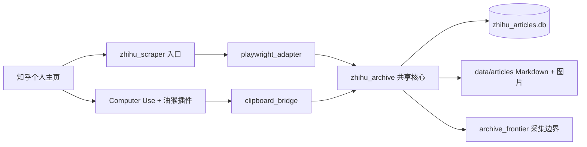

# 知乎本地归档工具

这是一个只在本机运行的知乎个人归档项目，提供两条采集通道：

1. **Playwright 程序采集**：适合积累较多时批量处理，从个人主页动态流读取正文、少量评论和图片。
2. **Computer Use + 油猴插件采集**：适合每天少量、及时归档，由浏览器完成接近人工的操作，再通过本地桥接程序统一保存。

两条通道共用同一个 SQLite 数据库、内容 ID、命名规则、文章目录和图片目录，因此可以交替使用，不会因为换采集方式而重复下载。

## 当前保存位置

所有开发和日常操作都在本项目完成，不再依赖旧项目目录。

```text
项目根目录/
├── data/articles/YYYY/MM/   Markdown 与同名图片目录
├── zhihu_articles.db        两条通道共用的去重数据库
├── state.json               Playwright 登录态
└── metadata_reports/        旧文件元数据补全报告
```

`state.json`、数据库和 `data/` 都是本机运行数据，默认不会提交到 Git。

## 项目结构

```text
zhihu_data_collection-playwright技术/
├── zhihu_scraper.py              Playwright 采集入口
├── clipboard_bridge.py           Computer Use 剪贴板桥接入口
├── init_login.py                 生成 Playwright 登录态
├── enrich_old_metadata.py        旧 Markdown 表头补全入口
├── playwright_adapter/           Playwright 页面与采集实现
│   ├── config.py                 运行路径和配置
│   ├── page_detection.py         登录、风控和页面异常检测
│   ├── activity_parser.py        动态元数据、稳定 ID 和时间解析
│   ├── comments.py               顶层评论、回复和 Markdown 格式化
│   ├── exporter.py               单条动态的正文、图片、YAML 和入库桥接
│   ├── incremental.py            日常增量扫描和边界控制
│   ├── backfill.py               历史日期区间回溯
│   └── debug.py                  只读评论调试
├── zhihu_archive/                两条通道共用的核心实现
│   ├── content.py                文件名、YAML、图片本地化
│   └── store.py                  SQLite、稳定 ID、采集边界
├── maintenance/
│   └── metadata_enrichment.py    旧文件元数据匹配与报告
├── docs/                         详细操作文档
├── tests/                        自动化测试
├── legacy_reference/             历史实现参考，不参与运行
├── data/articles/                归档数据
├── metadata_reports/             运行报告
└── AGENTS.md                     给 Codex/其他 AI 的维护约束
```

根目录保留可直接运行的稳定入口；`zhihu_scraper.py` 只负责命令行参数和旧 API 兼容转发。Playwright 细节集中在 `playwright_adapter/`，两种采集通道的保存规则则集中在 `zhihu_archive/`。



Computer Use 通道依赖当前 Codex 任务和可操作的 Chrome 会话，并不是脱离桌面独立运行的后台服务；日常启动方式及停止条件见专门文档。

## 安装

```powershell
Set-Location "F:\Git上的程序等等\zhihu_data_collection-playwright技术"
python -m venv .venv
.\.venv\Scripts\Activate.ps1
pip install -r requirements.txt
playwright install chromium
```

## 初始化登录

```powershell
python init_login.py
```

在弹出的 Chromium 中完成知乎登录，然后回到终端按 Enter。登录态默认保存到当前项目的 `state.json`。

## 方式一：Playwright 程序采集

日常手动采集建议使用“边界优先”模式：

```powershell
python zhihu_scraper.py --limit 30 --continue-to-boundary --max-new 200
```

默认行为：

- 访问固定主页 `https://www.zhihu.com/people/li-xiang-57-76`；
- 显示浏览器窗口；
- 保存到 `data/articles/YYYY/MM/`；
- 使用根目录的 `zhihu_articles.db` 去重；
- 对回答保存最多 30 条默认排序的顶层评论；
- 只展开前 2 条热门评论的回复，每条最多保存 10 条，因此最多附加 20 条回复；
- 命中上一次成功采集的边界后正常结束；
- `--limit 30` 是日常预期量；加上 `--continue-to-boundary` 后，30 条时未命中旧边界就会在同一浏览器会话中继续；
- `--max-new 200` 是绝对安全上限；到达上限仍未命中边界时，本轮标记为不完整，不推进边界。
- 如果数据库尚未建立旧边界，首轮仍只采集 `--limit` 条，用来安全建立初始边界。

常用选项：

```powershell
python zhihu_scraper.py --limit 30
python zhihu_scraper.py --limit 30 --no-comments
python zhihu_scraper.py --limit 30 --headless
python zhihu_scraper.py --limit 30 --url "https://www.zhihu.com/people/li-xiang-57-76"
```

不加 `--continue-to-boundary` 时，`--limit` 仍是原有的硬上限，因此旧命令保持兼容。边界优先模式不会增加并发，也不会重新打开浏览器；它只是在当前页面中继续串行向下扫描。

`--headless` 只控制是否显示浏览器，不会改变保存格式。考虑到风控，建议人工触发、控制频率；检测到登录页、安全验证、页面结构异常或连续滚动无增长时，程序会停止并生成 `zhihu_last_*.png`，不会持续重试。

评论与回复保持串行请求。由于知乎顶层评论接口单页最多接受 20 条，程序会以 `20 + 10` 的方式分页收集 30 条。程序优先复用顶层评论接口附带的回复，只在数量不足时才请求对应回复接口；单条回复线程失败不会丢失正文和已获取的顶层评论。这组规则属于 Playwright 程序采集；Computer Use 通道仍按其独立工作流执行。

### 历史回溯

```powershell
python zhihu_scraper.py --backfill-local `
  --start-date 2024-01-01 `
  --end-date 2024-12-31 `
  --limit 0 `
  --max-scrolls 10000
```

历史回溯只在主页动态流中滚动和展开，不打开回答详情页。详细参数可运行：

```powershell
python zhihu_scraper.py --help
```

## 方式二：Computer Use + 油猴插件

该方式不修改“知乎备份剪藏”油猴插件。Computer Use 负责打开主页、加载适量评论并点击“复制为 Markdown”；`clipboard_bridge.py` 负责把剪贴板内容转换成与程序采集完全一致的文件结构，并登记到共享数据库。

桥接程序会在写文件前检查作者、动态时间、动态动作、发布时间、来源链接和内容类型；任何必需字段缺失都会停止，不生成不完整归档。Computer Use 还应传入页面的完整标题，桥接程序会拒绝标题不匹配的旧剪贴板内容。

桥接流程：

```powershell
python clipboard_bridge.py begin-run
python clipboard_bridge.py inspect --run-id RUN_ID --content-key "answer:123456"
python clipboard_bridge.py ingest `
  --run-id RUN_ID `
  --activity-time "2026-09-13 21:08" `
  --activity-action "赞同了回答" `
  --author "作者名" `
  --published-at "2026-09-12 20:01" `
  --source-type "answer" `
  --content-url "https://www.zhihu.com/question/1/answer/123456" `
  --expected-title "页面上的完整标题"
python clipboard_bridge.py finish-run --run-id RUN_ID --boundary-hit
```

评论规则：评论不超过 30 条时尽量全部保存；更多时保存约一半，最多 200 条；默认只展开 3 条热门评论下的全部回复。必须继续检查到上次采集的重复内容，才能把本轮视为完整。

完整界面步骤见 [Computer Use 工作流](docs/COMPUTER_USE_WORKFLOW.md)。

## 两条通道如何避免重复

数据库不以标题作为唯一判断，因为同一问题下的不同回答可能同名。系统优先使用：

```text
answer:<回答 ID>
article:<文章 ID>
```

两条通道成功保存后都写入 `archive_items`。每轮从最新动态开始，把看到的内容记录到 `archive_runs`；只有命中旧边界或确认到达列表末尾时，才更新 `archive_frontier`。验证码、登录失效、数量上限和其他异常不会错误推进边界。

## 输出格式

通常文件名为：

```text
[YYYY-MM-DD_HH-MM] 标题.md
```

仅当同一分钟、同一标题发生真实路径冲突时增加伪秒：

```text
[YYYY-MM-DD_HH-MM-01] 标题.md
```

每篇 Markdown 使用统一 YAML 表头：

```yaml
---
title: "问题或文章标题"
author: "作者"
activity_at: "2026-09-13 02:46"
activity_action: "赞同了回答"
published_at: "2025-07-10 17:40:56"
source_url: "https://www.zhihu.com/question/.../answer/..."
source_type: "answer"
zhihu_answer_id: "123456"
---
```

图片保存在 Markdown 同目录下的同名文件夹中，正文链接改为相对路径，便于整体复制到 Obsidian 或其他归档位置。

## 旧文件补表头

先执行 dry-run，只生成报告：

```powershell
python enrich_old_metadata.py --start-date 2023-01-01 --end-date 2026-05-31
```

确认 `metadata_reports/` 中的匹配结果后再写入：

```powershell
python enrich_old_metadata.py --start-date 2023-01-01 --end-date 2026-05-31 --apply
```

详见 [元数据补全说明](docs/METADATA_ENRICHMENT.md)。

## 测试

```powershell
python -m unittest discover -s tests -v
python -m py_compile zhihu_scraper.py clipboard_bridge.py init_login.py enrich_old_metadata.py zhihu_archive\content.py zhihu_archive\store.py maintenance\metadata_enrichment.py
```

更简短的本地命令清单见 [本地使用说明](docs/LOCAL_USAGE.md)。已确认但暂缓的结构改进见 [后续改进记录](docs/ROADMAP.md)。本工具仅用于个人数据备份，请控制访问频率并遵守平台规则。
